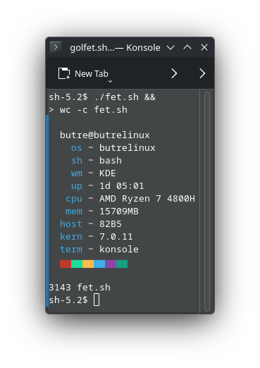

<div align="center">
<h1>golfet.sh</h1>
golfed fet.sh
<br>

</div>

### Installing
download fet.sh and run it with ```sh fet.sh```

### Customization
`fet.sh` has a few basic configuration options using environment variables, for example:
```
$ info='n os wm sh n' fet.sh
```
Supported options are:
- `accent` (0-7)
- `info`
- `separator`
- `colourblocks`

For less trivial configuration I recommend editing the script, I tried to keep it simple.

### Known Issues
MacOS, BSD, and Android don't show much info.

mem readout seems broken at the moment

### unknown issues
I minified the hell out of this and don't know what does or doesn't work when or where.  I have no QA pipeline, I'm just winging it.  it still does it's primary function acting as a fetch tool
